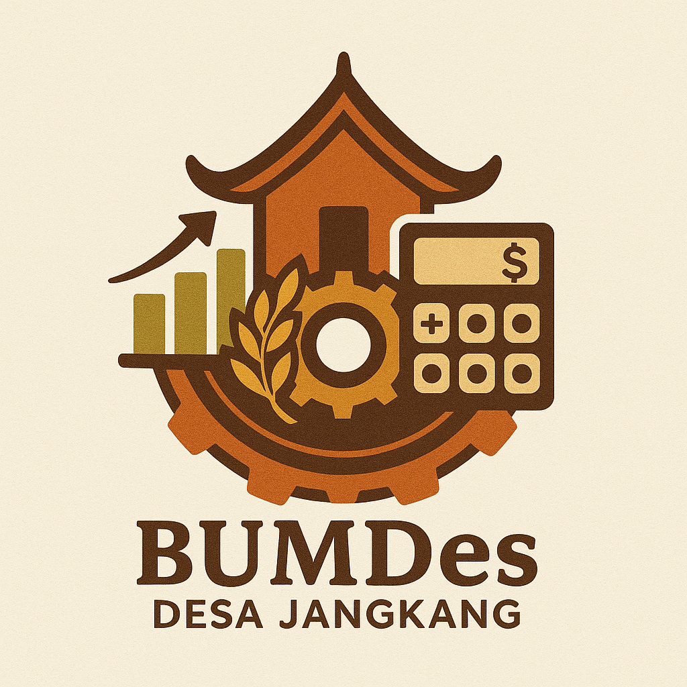
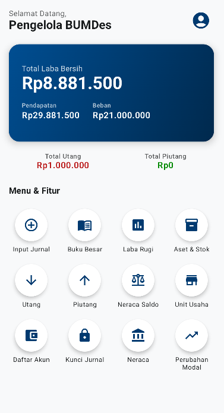
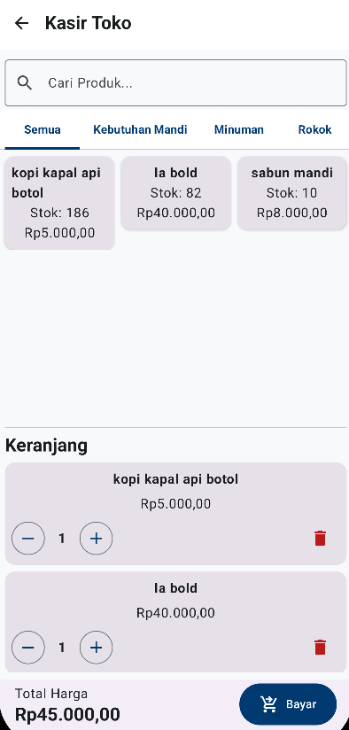
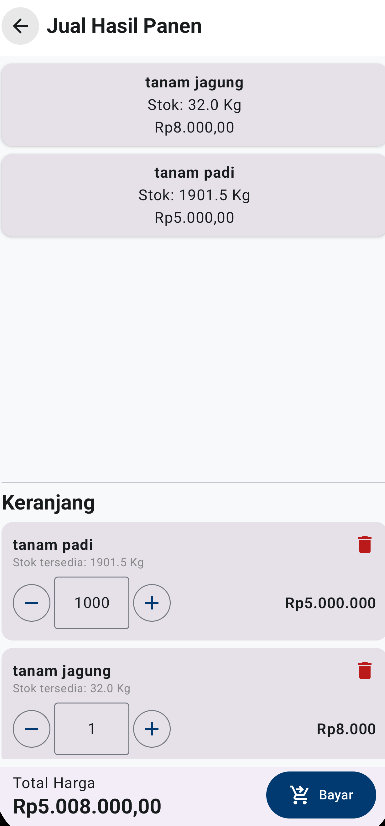
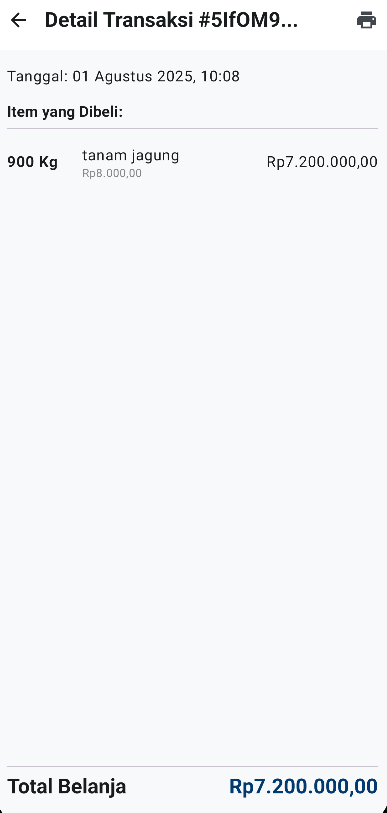

# BumdesKu - Aplikasi Akuntansi & Manajemen BUMDes



**BumdesKu** adalah aplikasi akuntansi dan manajemen operasional berbasis Android yang dirancang khusus untuk Badan Usaha Milik Desa (BUMDes) di Indonesia. Aplikasi ini bertujuan untuk mendigitalisasi pencatatan keuangan yang seringkali masih manual, sehingga BUMDes dapat beroperasi secara lebih efisien, transparan, dan akuntabel.

---

## 🎯 Latar Belakang

Banyak BUMDes di Indonesia yang masih mengandalkan pencatatan manual menggunakan buku. Hal ini rentan terhadap kesalahan manusia (*human error*), memakan waktu, dan menyulitkan pembuatan laporan keuangan yang akurat untuk evaluasi kinerja atau pertanggungjawaban. BumdesKu hadir sebagai solusi modern untuk mengatasi masalah ini dengan platform yang lengkap dan mudah digunakan langsung dari ponsel.

---

## ✨ Fitur Utama

Aplikasi ini dilengkapi dengan serangkaian fitur komprehensif yang mencakup hampir semua kebutuhan operasional BUMDes:

#### **Manajemen Keuangan & Akuntansi**
* **Jurnal Umum Digital:** Pencatatan semua transaksi keuangan dengan sistem *double-entry* yang akurat.
* **Buku Besar & Neraca Saldo:** Lacak riwayat dan saldo akhir dari setiap akun secara otomatis.
* **Laporan Keuangan Otomatis:** Hasilkan laporan Laba Rugi, Neraca (Laporan Posisi Keuangan), dan Laporan Perubahan Modal (Ekuitas) secara instan.
* **Ekspor ke PDF:** Semua laporan keuangan dapat diekspor ke format PDF untuk dicetak atau diarsipkan.
* **Kunci Jurnal:** Fitur khusus Manajer untuk menutup buku pada akhir periode akuntansi, menjaga integritas data yang sudah final.

#### **Manajemen Operasional**
* **Manajemen Multi-Unit Usaha:** Kelola beberapa unit usaha (misal: Toko, Agribisnis, Jasa Sewa) dalam satu aplikasi.
* **Modul Kasir (Point of Sale):** Sistem kasir terintegrasi untuk unit usaha toko, lengkap dengan manajemen stok otomatis.
* **Modul Agribisnis:**
    * **Siklus Produksi:** Lacak biaya dari awal tanam hingga panen untuk menghitung Harga Pokok Produksi (HPP) secara akurat.
    * **Manajemen Stok Panen & Inventaris:** Catat hasil panen dan inventaris pertanian.
    * **Penjualan Hasil Panen:** Fitur kasir khusus untuk menjual produk hasil panen.
* **Manajemen Aset & Stok:** Lacak semua aset dan inventaris barang yang dimiliki BUMDes.
* **Manajemen Utang & Piutang:** Pantau dan kelola semua utang dan piutang usaha yang sedang berjalan.

#### **Administrasi & Lainnya**
* **Akses Berbasis Peran (Role):**
    * **Manager:** Akses penuh ke semua data di semua unit usaha.
    * **Pengurus:** Akses terbatas hanya pada unit usaha yang ditugaskan.
    * **Auditor:** Akses *read-only* ke semua data dan laporan untuk keperluan audit.
* **Cetak Struk via Bluetooth:** Hubungkan aplikasi dengan printer kasir thermal via Bluetooth untuk mencetak struk belanja secara nirkabel.
* **Sinkronisasi Real-time:** Semua data disimpan di Cloud Firestore, memastikan data selalu ter-update di semua perangkat dan aman.
* **Mode Offline:** Aplikasi tetap dapat diakses berkat *caching* data di *database* lokal (Room).

---

## 🛠️ Teknologi yang Digunakan

Proyek ini dibangun menggunakan teknologi modern dari ekosistem Android dan Google.

* **UI:** 100% [Jetpack Compose](https://developer.android.com/jetpack/compose) untuk antarmuka yang deklaratif dan modern.
* **Arsitektur:** [MVVM (Model-View-ViewModel)](https://developer.android.com/jetpack/guide)
* **Asynchronous:** [Kotlin Coroutines & Flow](https://kotlinlang.org/docs/coroutines-guide.html) untuk manajemen *background task* dan *data stream* yang efisien.
* **Backend & Database:**
    * [Cloud Firestore](https://firebase.google.com/docs/firestore): Sebagai *database* utama (NoSQL) untuk sinkronisasi data *real-time*.
    * [Room](https://developer.android.com/jetpack/androidx/releases/room): Sebagai *database* lokal untuk *caching* dan dukungan *offline*.
* **Autentikasi:** [Firebase Authentication](https://firebase.google.com/docs/auth)
* **Navigasi:** [Jetpack Navigation Compose](https://developer.android.com/jetpack/compose/navigation)
* **Grafik:** [MPAndroidChart](https://github.com/PhilJay/MPAndroidChart)
* **Bahasa:** [Kotlin](https://kotlinlang.org/)

---

## 🚀 Menjalankan Proyek

Untuk menjalankan proyek ini di komputer Anda, ikuti langkah-langkah berikut:

1.  **Prasyarat**
    * Pastikan Anda memiliki [Android Studio](https://developer.android.com/studio) versi terbaru.
    * Koneksi internet untuk sinkronisasi Gradle.

2.  **Clone Repository**
    ```sh
    git clone [https://github.com/](https://github.com/)[NAMA_PENGGUNA_ANDA]/[NAMA_REPO_ANDA].git
    ```

3.  **Pengaturan Firebase**
    * Proyek ini memerlukan koneksi ke Firebase untuk berfungsi.
    * Buka [Firebase Console](https://console.firebase.google.com/).
    * Buat proyek Firebase baru.
    * Tambahkan aplikasi Android baru ke proyek Firebase Anda dengan nama paket (package name): `com.dony.bumdesku`.
    * Unduh file konfigurasi `google-services.json` yang disediakan.
    * Salin file `google-services.json` tersebut ke dalam direktori `app/` di proyek Android Studio Anda.
    * Di Firebase Console, aktifkan layanan **Authentication** (dengan metode Email/Password) dan **Cloud Firestore**.

4.  **Build & Run**
    * Buka proyek di Android Studio.
    * Biarkan Gradle melakukan sinkronisasi dependensi.
    * Jalankan aplikasi di emulator atau perangkat fisik.

---

## 📸 Tampilan Aplikasi (Screenshots)

*(Disarankan untuk menambahkan beberapa gambar tangkapan layar di sini untuk menunjukkan tampilan aplikasi Anda, seperti Halaman Utama, Layar Kasir, atau Laporan Keuangan)*

| Halaman Utama | Kasir Toko | Kasir Agribisnis | Struk Digital |
| :-----------: | :--------: | :--------------: | :-----------: |
| |  |  | |


---

## 📜 Lisensi

Proyek ini dilisensikan di bawah Lisensi [MIT](LICENSE.md).
